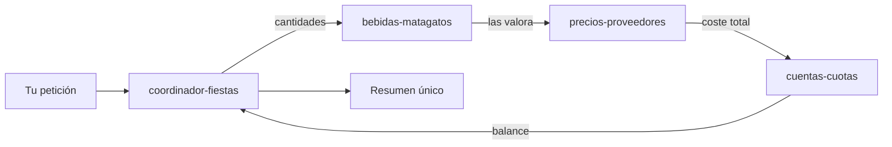

# Agentes de la Peña Matagatos

Agentes especializados de VS Code (Copilot) para preparar y cuadrar las fiestas.
Cada uno vive en un fichero `*.agent.md` de esta carpeta y aparece en el
selector de agentes del chat.

## Cómo usarlos
1. Abre el chat de Copilot.
2. En el selector de modo/agente, elige el agente que quieras.
3. Escribe tu petición en español.

Si no sabes cuál elegir, empieza por **coordinador-fiestas**: entiende la
petición global y reparte el trabajo entre los especializados.

## Agentes disponibles

| Agente | Para qué sirve | Cuándo usarlo |
|---|---|---|
| **coordinador-fiestas** | Punto de entrada. Descompone la petición y delega en los demás, integrando el resultado. | Tareas que tocan varias áreas o cuando no sabes qué agente elegir. |
| **bebidas-matagatos** | Estima consumo y cantidades a comprar (persona-días, sobrante ~5%, tipos de cerveza, formatos, caducidad). | "¿Cuánto compramos de X?", cantidades, consumo, sobrante. |
| **precios-proveedores** | Compara precios entre proveedores y calcula el coste total de la compra. | "¿Cuánto cuesta?", "¿qué proveedor es más barato?". |
| **cuentas-cuotas** | Calcula el bote (cuotas 55/65/75 €), lo compara con el coste real y saca el balance por persona. | "¿Cuadra el bote?", cuotas, balance, quién paga. |

## Cómo trabajan juntos

El coordinador encadena a los especializados en el orden lógico:



> Nota: un subagente devuelve **un único informe final** al coordinador (no hay
> ida y vuelta de mensajes). Para trabajo iterativo y conversado, habla
> directamente con el agente especializado.

## Datos que usan
- `fiestas-2026-plan-bebida.md`, `fiestas-2026-lista-compra.json`, `fiestas-2026-bebidas.json`
- `historico/2026/cuentas/` — tickets reales y estimación (`MATAGATOS-2026-estimacion.md`)
- Memoria de repo `/memories/repo/fiestas-conventions.md` — cuotas, reglas y formatos

## Reglas clave (resumen)
- **Cuotas:** 55 € (2 días), 65 € (3 días), 75 € (todos los días), por persona.
- **Compra bebida:** `compra = consumo_real_2025 × 1,05 − sobrante_reutilizable`.
- **Cerveza:** 3 tipos (Mahou Clásica, Mahou 5 Estrellas, Estrella Galicia).
- **Tickets:** en `real_comprado/` se guardan las fotos; los `.json`/`.md` se
  ajustan por producto aunque un ticket mezcle categorías.

## Añadir un agente nuevo
Crea un fichero `nombre.agent.md` en esta carpeta con este frontmatter:

```markdown
---
description: Qué hace y cuándo usarlo.
tools: ['read_file', 'grep_search', 'file_search', 'list_dir', 'create_file']
---

# Instrucciones del agente
...
```
