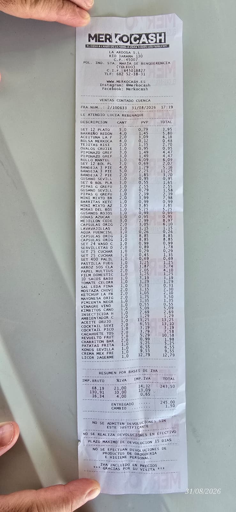
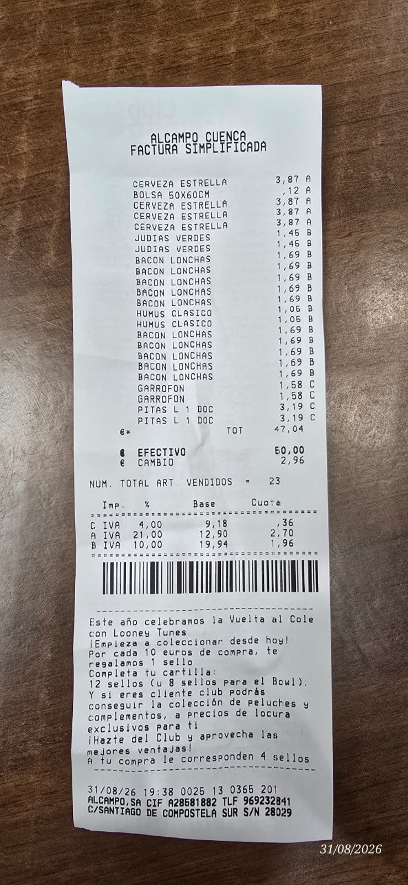
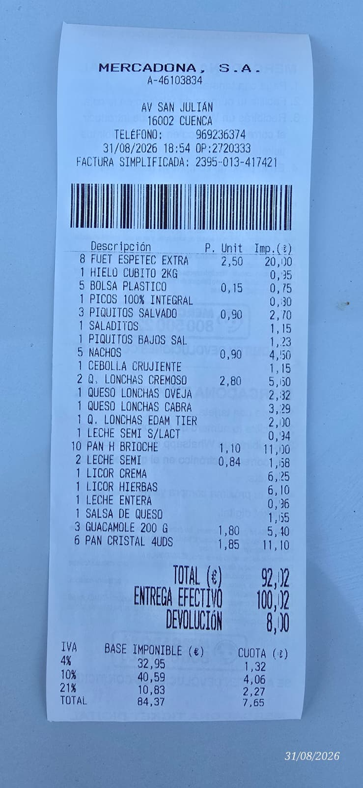

# Resumen 2026

> Apartado nuevo en formato MkDocs para leer de un vistazo la asistencia, la compra y las cuentas de **Fiestas 2026**.  
> Si quieres ir a la zona operativa de siempre, sigue en <a href="../Fiestas/index.html">Fiestas 2026</a>.

  <article class="summary-card">
    
Asistencia registrada

    
29

    
Miembros con asistencia y bebida cargadas en la lista actual.

  </article>
  <article class="summary-card">
    
Persona-días

    
101

    
Cota de trabajo usada para planificar la compra del año.

  </article>
  <article class="summary-card">
    
Gasto bruto registrado

    
1.913,58 €

    
Compra real consolidada, incluida la factura de Licoreo y su devolución posterior.

  </article>
  <article class="summary-card">
    
Saldo de caja

    
+26,42 €

    
Bote fiestas: 1.940,00 € − 1.913,58 € gastados; Álvaro pagó sus 65,00 € a altavoces.

  </article>

  <strong>Lectura rápida:</strong> este resumen unifica lo que ya estaba repartido entre los README, la lista de asistencia/bebida y los JSON de compra real. Para las cifras actuales mandan los datos consolidados de <code>historico/2026/gastos-2026.json</code>; algunas páginas HTML antiguas siguen mostrando un corte anterior.

## Lo importante en dos minutos

- **La peña tiene 30 miembros oficiales**. La lista de fiestas tiene **29 asistentes**: 28 miembros oficiales y Andreas como invitado extra; Juanvi y Lucía no asistieron.
- El plan de bebida trabaja con **101 persona-días**: se suman los días que estuvo cada una de las 29 personas asistentes. No son 101 personas ni 101 cuotas; es una medida de presencia acumulada para estimar el consumo.
- El bote de fiestas suma **1.940 €**: 1.860 € de cuotas efectivas (sin Álvaro) más 30 € de Laura y 50 € devueltos de la reserva de sillas. El total global recibido, contando los 65 € de Álvaro para altavoces, es **2.005 €**.
- Con la carne de BBQ incluida, el saldo del bote de fiestas queda en **+26,42 €**, antes de cualquier gasto nuevo.
- Fuera del bote van los **altavoces (207,38 €)**, que se reparten entre los 30 miembros oficiales. El regalo del dueño (`60,00 €`) sí sale del bote de los asistentes de 2026.

## 1) Asistencia y bebidas registradas

La tabla base sale de `fiestas-2026-bebidas.json`, que es la lista más cómoda para revisar quién viene y qué bebe cada uno.

| Persona | Asistencia | Bebidas | Cuota | Ajustes | Aporta al bote |
|---|---|---|---:|---|---:|
| Marta | jueves a domingo | cerveza 0,0 casera, Coca-Cola Zero Zero (0,0) | 65,00 €* | — | 65,00 € |
| Flores | jueves a domingo | cerveza, Seagrams Sprite | 75,00 € | — | 75,00 € |
| Chechu | todos los días | cerveza, ron con limón (Ron: Barceló, Brugal Legendario o similar, con limón.) | 75,00 € | — | 75,00 € |
| Esmeralda | todos los días | Coca-Cola Zero, Aquarius naranja | 75,00 € | — | 75,00 € |
| Josemi | todos los días | cerveza, Legendario limón | 75,00 € | — | 75,00 € |
| Eve | todos los días | cerveza, Legendario limón | 75,00 € | — | 75,00 € |
| Leti | todos los días | cerveza, Cutty naranja, Coca-Cola Zero | 75,00 € | +50,00 € sillas | 125,00 € |
| Javi | sábado y domingo | cerveza, ginebra con Sprite, Coca-Cola | 55,00 € | — | 55,00 € |
| Andreas (extra 2026) | todos los días | gin-tonic | 75,00 € | — | 75,00 € |
| Álvaro | jueves a sábado | cerveza, ginebra limón, ginebra tónica | 65,00 € | −65,00 € altavoces | **0,00 €** |
| Elisa | jueves a sábado | cerveza, ginebra limón | 65,00 € | — | 65,00 € |
| Laura | todos los días | cerveza, Coca-Cola, agua | 75,00 € | +30,00 € aportación | 105,00 € |
| Nacho | todos los días | cerveza, Coca-Cola, agua | 75,00 € | — | 75,00 € |
| David | jueves a sábado | cerveza, Larios 12 limón | 65,00 € | — | 65,00 € |
| Malu | viernes y sábado | Aquarius naranja, Barceló Coca-Cola Zero | 55,00 € | — | 55,00 € |
| Ernesto | viernes y sábado | cerveza, gin-tonic Seagrams | 55,00 € | — | 55,00 € |
| Cristina | todos los días | cerveza 0,0, Coca-Cola Zero Zero (0,0) | 75,00 € | — | 75,00 € |
| Blanca | jueves a sábado | cerveza, ginebra tónica | 65,00 € | — | 65,00 € |
| María | jueves, viernes y sábado | cerveza, Coca-Cola, ginebra limón | 65,00 € | — | 65,00 € |
| Samuel | viernes y sábado | cerveza, Coca-Cola, ginebra tónica | 55,00 € | — | 55,00 € |
| María Rubia | viernes y sábado | cerveza, Cutty limón, Jägermeister | 55,00 € | — | 55,00 € |
| Pimen | hasta el sábado por la tarde | agua, Coca-Cola Zero, helados (Trae tortillas o comida preparada si es posible.) | 65,00 € | — | 65,00 € |
| Albert | todos los días | cerveza 0,0 sin tostada, Coca-Cola Zero | 75,00 € | — | 75,00 € |
| Sonia | jueves a sábado | cerveza 0,0, Coca-Cola Zero Zero (0,0), Aquarius limón, agua | 65,00 € | — | 65,00 € |
| Raúl | todos los días | cerveza 0,0, Coca-Cola | 75,00 € | — | 75,00 € |
| Edu | viernes y sábado | cerveza Estrella Galicia | 55,00 € | — | 55,00 € |
| Helena | viernes y sábado (jueves incógnita) | radler, tinto de verano, Barceló con Coca-Cola Zero | 65,00 € | — | 65,00 € |
| Tamara | 2 días | cerveza con gaseosa, Coca-Cola Zero | 55,00 € | — | 55,00 € |
| Zara | viernes y sábado | cerveza, Seagrams limón | 55,00 € | — | 55,00 € |

**Resumen de pagos:** cuotas teóricas `1.925,00 €` · cuotas efectivas para el bote `1.860,00 €` (sin Álvaro) · aportación Laura `30,00 €` · devolución de sillas recogida por Leti `50,00 €` · **bote de fiestas `1.940,00 €`**. Sumando los `65,00 €` de Álvaro aplicados a altavoces, el dinero global recibido es `2.005,00 €`. *Marta queda en el tramo de 65,00 € para conservar el reparto contable ya cerrado de 8 cuotas de 2 días, 9 de 3 días y 12 de todos los días; conviene confirmarlo si queréis que la tarifa siga exactamente los días.*

### Notas de contexto

- El plan humano (`fiestas-2026-plan-bebida.md`) mantiene separados los 30 miembros oficiales de los 29 asistentes de 2026 y de Andreas, que fue invitado extra.
- **101 persona-días** significa sumar la asistencia individual: por ejemplo, una persona que estuvo 5 días aporta 5 persona-días y una que estuvo 2 días aporta 2. La suma de las 29 personas asistentes da 101 y sirve para estimar bebida; las cuotas se calculan por persona según su tramo de asistencia.
- El pico de consumo sigue concentrado en **viernes y sábado**.

## 2) Compra real y cuentas del bote

El consolidado actual está en `historico/2026/gastos-2026.json`, alimentado por los JSON de tickets normalizados dentro de `Fiestas/2026/comprareal/`.

### Ingresos del bote antes de comprar

Primero se reúne el dinero disponible; después se registran las compras y finalmente se hace el balance.

| Ingreso | Importe | Tratamiento |
|---|---:|---|
| Cuotas teóricas de asistentes | 1.925,00 € | 1.860,00 € van al bote; los 65,00 € de Álvaro se aplicaron a altavoces |
| Aportación monetaria de Laura | 30,00 € | Cobrada y utilizada en compras nuevas |
| Devolución de sillas no compradas | 50,00 € | Cobrada y reutilizada en compras |
| **Bote efectivo para fiestas** | **1.940,00 €** | |
| Dinero recibido incluyendo altavoces | 2.005,00 € | Incluye los 65,00 € de Álvaro fuera del bote |

### Auditoría de tickets finales

Esta es la tabla de comprobación de la compra real. Los importes de tickets mixtos son solo la parte asignada a la categoría; por eso el mismo documento puede aparecer en varias filas, pero nunca se suma dos veces dentro del total global.

| Fecha | Proveedor | Categoría | Importe normalizado | Evidencia |
|---|---|---|---:|---|
| 26/08/2026 | Licoreo | Bebida | 810,00 € netos | [Factura final](../Fiestas/2026/comprareal/Factura%20Final%20Licoreo%20Matagatos%202026.jpeg) · [JSON bebida](../Fiestas/2026/comprareal/tickets-bebida.json) |
| 31/08/2026 | Merkocash | Comida | 144,08 € | [Foto](../Fiestas/2026/comprareal/Mercocash.jpeg) · [JSON comida](../Fiestas/2026/comprareal/tickets-comida.json) |
| 31/08/2026 | Merkocash | Bebida | 13,05 € | [Foto](../Fiestas/2026/comprareal/Mercocash.jpeg) · [JSON bebida](../Fiestas/2026/comprareal/tickets-bebida.json) |
| 31/08/2026 | Merkocash | Menaje | 86,37 € | [Foto](../Fiestas/2026/comprareal/Mercocash.jpeg) · [JSON menaje](../Fiestas/2026/comprareal/tickets-menaje.json) |
| 31/08/2026 | Alcampo | Comida | 31,44 € | [Foto](../Fiestas/2026/comprareal/Alcampo.jpeg) · [JSON comida](../Fiestas/2026/comprareal/tickets-comida.json) |
| 31/08/2026 | Alcampo | Bebida | 15,48 € | [Foto](../Fiestas/2026/comprareal/Alcampo.jpeg) · [JSON bebida](../Fiestas/2026/comprareal/tickets-bebida.json) |
| 31/08/2026 | Alcampo | Menaje | 0,12 € | [Foto](../Fiestas/2026/comprareal/Alcampo.jpeg) · [JSON menaje](../Fiestas/2026/comprareal/tickets-menaje.json) |
| 31/08/2026 | Mercadona | Comida | 77,37 € | [Foto](../Fiestas/2026/comprareal/Mercadona.jpeg) · [JSON comida](../Fiestas/2026/comprareal/tickets-comida.json) |
| 31/08/2026 | Mercadona | Bebida | 12,35 € | [Foto](../Fiestas/2026/comprareal/Mercadona.jpeg) · [JSON bebida](../Fiestas/2026/comprareal/tickets-bebida.json) |
| 31/08/2026 | Mercadona | Menaje | 2,30 € | [Foto](../Fiestas/2026/comprareal/Mercadona.jpeg) · [JSON menaje](../Fiestas/2026/comprareal/tickets-menaje.json) |
| 31/08/2026 | Diseño (bazar) | Menaje | 61,08 € | [Foto](../Fiestas/2026/comprareal/Diseño%20Chino.jpeg) · [JSON menaje](../Fiestas/2026/comprareal/tickets-menaje.json) |
| 31/08/2026 | Amazon | Bebida | 15,96 € | [Foto](../Fiestas/2026/comprareal/Amazon%20Cerveza%200,0.jpeg) · [JSON bebida](../Fiestas/2026/comprareal/tickets-bebida.json) |
| 02/09/2026 | Amazon | Bebida | 25,20 € | [Pedido](https://amzn.eu/d/0fOtCgQW) · [JSON bebida](../Fiestas/2026/comprareal/tickets-bebida.json) |
| 03/09/2026 | Carnes Javi | Comida | 153,85 € | [Foto embutidos](../Fiestas/2026/comprareal/Embutidos%20Javi.jpeg) · [JSON comida](../Fiestas/2026/comprareal/tickets-comida.json) |
| 03/09/2026 | Carnes Javi | Comida | 8,04 € | [Foto queso](../Fiestas/2026/comprareal/Embutidos%20Javi%20Queso%20sin%20Lactosa.jpeg) · [JSON comida](../Fiestas/2026/comprareal/tickets-comida.json) |
| 03/09/2026 | Mercadona 2 | Comida | 115,95 € | [Foto](../Fiestas/2026/comprareal/Mercadona%202.jpeg) · [JSON comida](../Fiestas/2026/comprareal/tickets-comida.json) |
| 2026 | Panadería | Comida | 23,40 € | 18 barras × 1,30 € · [JSON comida](../Fiestas/2026/comprareal/tickets-comida.json) |
| 2026 | Compra posterior de agua | Bebida | 9,00 € | Sin ticket adjunto |
| 03/09/2026 | Carnicería Loli · pedido BBQ | Comida | 218,64 € | [Foto/ticket](../Fiestas/2026/comprareal/Carniceria%20Luis%202026.jpeg) · 20 hamburguesas pollo, 20 ternera, 7 kg magro, 35 pancetas, 35 lomos, 40 bacon, 20 chorizos, 15 morcillas, 2 kg pollo, 1 kg conejo |
| 2026 | Compra posterior de helados | Comida | 9,90 € | Ticket pendiente de traer |
| 2026 | Cuchillos y tabla de partir | Menaje | 20,00 € | [Precio/foto](../Fiestas/2026/comprareal/Precio%20tabla%20con%20cuchillos.jpeg) · [JSON menaje](../Fiestas/2026/comprareal/tickets-menaje.json) |
| 2026 | Devolución de reserva de sillas | Ajuste | −50,00 € | Se devolvió al bote; las sillas no se compraron |

**Totales normalizados:** comida `782,67 €` · bebida `901,04 €` · menaje `169,87 €` · generales del bote `60,00 €` · **gasto bruto del bote `1.913,58 €`**.

El detalle de cada línea, con cantidad, unidad, precio unitario e importe, está disponible en los JSON finales: [bebida](../Fiestas/2026/comprareal/tickets-bebida.json), [comida](../Fiestas/2026/comprareal/tickets-comida.json), [menaje](../Fiestas/2026/comprareal/tickets-menaje.json), [altavoces](../Fiestas/2026/comprareal/tickets-altavoces.json) y [generales](../Fiestas/2026/comprareal/tickets-generales.json).

### Conciliación por ticket físico

Esta tabla comprueba que las líneas repartidas entre comida, bebida, menaje y gastos generales vuelven a sumar el importe del documento original. En los tickets mixtos, cada categoría se cuenta una sola vez.

| Documento físico | Comida | Bebida | Menaje | Generales | Suma normalizada | Total de la foto/documento | Diferencia |
|---|---:|---:|---:|---:|---:|---:|---:|
| Merkocash | 144,08 € | 13,05 € | 86,37 € | — | **243,50 €** | 243,50 € | 0,00 € |
| Alcampo | 31,44 € | 15,48 € | 0,12 € | — | **47,04 €** | 47,04 € | 0,00 € |
| Mercadona | 77,37 € | 12,35 € | 2,30 € | — | **92,02 €** | 92,02 € | 0,00 € |
| Diseño Chino | — | — | 61,08 € | — | **61,08 €** | 61,08 € | 0,00 € |
| Amazon · Mahou 0,0 | — | 15,96 € | — | — | **15,96 €** | 15,96 € | 0,00 € |
| Amazon · S.Pellegrino | — | 25,20 € | — | — | **25,20 €** | 25,20 € | 0,00 € |
| Carnes Javi · embutidos + regalo | 153,85 € | — | — | 60,00 € | **213,85 €** | 213,85 € | 0,00 € |
| Carnes Javi · queso sin lactosa | 8,04 € | — | — | — | **8,04 €** | 8,04 € | 0,00 € |
| Carnicería Loli · pedido BBQ | 218,64 € | — | — | — | **218,64 €** | 218,64 € | 0,00 € |
| Mercadona 2 | 115,95 € | — | — | — | **115,95 €** | 115,95 € | 0,00 € |
| Panadería (encargo) | 23,40 € | — | — | — | **23,40 €** | 18 barras × 1,30 € · sin foto de ticket | — |
| Compras posteriores | 9,90 € | 9,00 € | 20,00 € | — | **38,90 €** | sin documento completo | — |
| Licoreo · conciliación económica | — | 810,00 € netos | — | — | **810,00 €** | 834,00 € pagados − 24,00 € devueltos | — |
| **Total gasto bruto documentado** | **782,67 €** | **901,04 €** | **169,87 €** | **60,00 €** | **1.913,58 €** | **1.913,58 €** | **0,00 €** |

El total documental/provisional de esta tabla (`1.863,58 €`) incluye el regalo del dueño de `60,00 €`, el pedido BBQ, las compras posteriores y Licoreo a coste neto. No incluye el saco de carbón regalado por Diseño Chino ni el ingreso de `50,00 €` de las sillas, que se muestra aparte como ingreso del bote. Los `30,00 €` de Laura ya están cobrados como aportación monetaria y se han utilizado para compras nuevas.

### Factura final de Licoreo

  <figure class="evidence-card">
    
    <figcaption>Total impreso: 835,89 €. Pago final manuscrito: 834,00 €. Haz clic para verla a tamaño completo.</figcaption>
  </figure>

El total impreso de la factura es `835,89 €`, pero el pago final anotado a mano fue `834,00 €`. Después, Licoreo devolvió `24,00 €` por transferencia por las cajas de Estrella Galicia servidas en 20 cl en vez de 25 cl. El coste neto usado en las cuentas es `810,00 €`. Se pidieron 3 botellas de Cutty Sark de 70 cl y se recibieron 2 botellas de 1 litro.

| Conciliación Licoreo | Dato final |
|---|---:|
| Total impreso en factura | 835,89 € |
| Pago final anotado a mano | 834,00 € |
| Devolución posterior por transferencia | −24,00 € |
| Coste neto real contabilizado | **810,00 €** |
| Cutty Sark pedido | 3 botellas de 70 cl |
| Cutty Sark recibido | 2 botellas de 1 litro |
| Incidencia Estrella Galicia | 12 cajas de 20 cl en vez de 25 cl |

### Tickets y facturas para comprobación visual

| Documento | Vista previa | Descarga | Gasto | Nota |
|---|---|---|---:|---|
| Merkocash | [Abrir imagen](../Fiestas/2026/comprareal/Mercocash.jpeg) | [JPEG](../Fiestas/2026/comprareal/Mercocash.jpeg) | **243,50 €** | Ticket mixto: comida, bebida y menaje |
| Alcampo | [Abrir imagen](../Fiestas/2026/comprareal/Alcampo.jpeg) | [JPEG](../Fiestas/2026/comprareal/Alcampo.jpeg) | **47,04 €** | Ticket mixto: comida, bebida y menaje |
| Mercadona | [Abrir imagen](../Fiestas/2026/comprareal/Mercadona.jpeg) | [JPEG](../Fiestas/2026/comprareal/Mercadona.jpeg) | **92,02 €** | Ticket mixto: comida, bebida y menaje |
| Diseño (bazar) | [Abrir imagen](../Fiestas/2026/comprareal/Diseño%20Chino.jpeg) | [JPEG](../Fiestas/2026/comprareal/Diseño%20Chino.jpeg) | **61,08 €** | Menaje |
| Amazon · Mahou 0,0 | [Abrir imagen](../Fiestas/2026/comprareal/Amazon%20Cerveza%200,0.jpeg) | [JPEG](../Fiestas/2026/comprareal/Amazon%20Cerveza%200,0.jpeg) | **15,96 €** | Bebida |
| Amazon · S.Pellegrino agua con gas | [Pedido](https://amzn.eu/d/0fOtCgQW) | [JSON bebida](../Fiestas/2026/comprareal/tickets-bebida.json) | **25,20 €** | Bebida; pedido 24x50 cl |
| Carnes Javi · embutidos | [Abrir imagen](../Fiestas/2026/comprareal/Embutidos%20Javi.jpeg) | [JPEG](../Fiestas/2026/comprareal/Embutidos%20Javi.jpeg) | **213,85 €** | 153,85 € comida + 60,00 € regalo dentro del bote |
| Carnes Javi · queso sin lactosa | [Abrir imagen](../Fiestas/2026/comprareal/Embutidos%20Javi%20Queso%20sin%20Lactosa.jpeg) | [JPEG](../Fiestas/2026/comprareal/Embutidos%20Javi%20Queso%20sin%20Lactosa.jpeg) | **8,04 €** | Comida |
| Mercadona 2 · trenzas y repostería | [Abrir imagen](../Fiestas/2026/comprareal/Mercadona%202.jpeg) | [JPEG](../Fiestas/2026/comprareal/Mercadona%202.jpeg) | **115,95 €** | Comida |
| Panadería · encargo | Sin foto | [JSON comida](../Fiestas/2026/comprareal/tickets-comida.json) | **23,40 €** | 18 barras × 1,30 € |
| Agua adicional | Sin foto | [JSON de cuentas](../historico/2026/gastos-2026.json) | **9,00 €** | Compra posterior |
| Helados | Sin foto | [JSON de cuentas](../historico/2026/gastos-2026.json) | **9,90 €** | Ticket pendiente de traer |
| Cuchillos y tabla de partir | [Abrir imagen](../Fiestas/2026/comprareal/Precio%20tabla%20con%20cuchillos.jpeg) | [JPEG](../Fiestas/2026/comprareal/Precio%20tabla%20con%20cuchillos.jpeg) | **20,00 €** | Compra posterior dentro del bote 2026 |
| Devolución sillas no compradas | Sin foto | [JSON de cuentas](../historico/2026/gastos-2026.json) | **+50,00 €** | Ingreso extra del bote, posteriormente gastado |
| Licoreo · factura final | [Ver imagen](../Fiestas/2026/comprareal/Factura%20Final%20Licoreo%20Matagatos%202026.jpeg) | [JPEG](../Fiestas/2026/comprareal/Factura%20Final%20Licoreo%20Matagatos%202026.jpeg) | **810,00 €** | 834,00 € pagados − 24,00 € devueltos |
| Carnicería Loli · pedido BBQ | [Abrir imagen](../Fiestas/2026/comprareal/Carniceria%20Luis%202026.jpeg) | [JPEG](../Fiestas/2026/comprareal/Carniceria%20Luis%202026.jpeg) | **218,64 €** | Pedido completo de carne para la barbacoa |
| **Total gasto bruto** |  |  | **1.913,58 €** | Compras realizadas, incluido BBQ y regalo dentro del bote |
| **Total ingresos extra** |  |  | **+50,00 €** | Devolución de sillas no compradas |
| **Gasto neto financiado por cuotas/aportaciones** |  |  | **1.863,58 €** | Gasto bruto menos devolución recibida |

> **Nota informativa:** Diseño Chino nos regaló un saco grande de carbón valorado en 12,00 €. No tenemos ticket ni fue una compra pagada por la peña, así que no aparece como línea de gasto ni se suma a estos totales.

> **Aportación de Laura:** Laura aportó `30,00 €` en dinero al bote de cuotas. Ese dinero se utilizó para financiar compras nuevas de 2026; se registra como ingreso monetario, no como bebida en especie ni como gasto pendiente.

> **Hielo:** ya está contabilizada una bolsa de hielo de 2 kg por `1,55 €` en el ticket de Mercadona, usada para mantener productos frescos. Los sacos grandes de hielo previstos para la fiesta no tienen todavía un ticket o importe registrado.

  
Mostrar todas las fotos dentro de MkDocs

  

    <figure class="evidence-card"><figcaption>Mercocash</figcaption></figure>
    <figure class="evidence-card"><figcaption>Alcampo</figcaption></figure>
    <figure class="evidence-card"><figcaption>Mercadona</figcaption></figure>
    <figure class="evidence-card"><figcaption>Diseño Chino</figcaption></figure>
    <figure class="evidence-card"><figcaption>Amazon · Mahou 0,0</figcaption></figure>
    <figure class="evidence-card"><figcaption>Embutidos Javi</figcaption></figure>
    <figure class="evidence-card"><figcaption>Queso sin lactosa</figcaption></figure>
    <figure class="evidence-card"><figcaption>Mercadona 2</figcaption></figure>
    <figure class="evidence-card"><figcaption>Tabla con cuchillos · 20,00 €</figcaption></figure>
  

### Resumen por categoría

| Categoría | Importe |
|---|---:|
| Comida | 782.67 € |
| Bebida | 901.04 € |
| Menaje | 169.87 € |

### Situación del cierre

- **Bote de fiestas:** 1.940,00 € (cuotas efectivas + Laura + devolución de sillas)
- **Dinero total recibido contando altavoces:** 2.005,00 €
- **Gasto bruto registrado:** 1.913,58 €
- **Saldo de caja del bote:** +26,42 € (1.940,00 € cobrados/aportados − 1.913,58 € gastados)
- **Cuotas cobradas para el bote:** 1.860,00 €; Álvaro no aporta cuota y sus 65,00 € van a altavoces
- **Pendiente de cobro:** 0,00 €
- **Pendientes de cerrar:** puede aparecer algún gasto adicional. La carne BBQ de Carnicería Loli está registrada: 218,64 €. Álvaro pagó 65,00 € de altavoces, no de cuota. Los 30,00 € de Laura y los 50,00 € devueltos de sillas están incorporados al bote. Licoreo está cerrado: pago 834,00 € menos 24,00 € devueltos = 810,00 € netos.

### Extras que no salen del bote

| Extra general | Importe |
|---|---:|
| Altavoces y montaje | 207.38 € |
| **Total** | **207.38 €** |

Eso deja un reparto adicional de **6,91 € por miembro oficial** fuera de las cuotas de fiestas. El regalo del dueño, de `60,00 €`, sí está dentro del gasto del bote 2026.

## 3) Cómo se está guardando la compra real

> **Regla clave del README de cuentas:** los tickets se mezclan, los datos no.

- Un ticket físico puede tener bebida, comida y menaje a la vez.
- La **foto se guarda una sola vez** en la carpeta de la categoría que más pesa.
- Las **líneas se reparten** entre `tickets-bebida.json`, `tickets-comida.json` y `tickets-menaje.json`.
- Así el resumen final puede sacar cuentas limpias por categoría aunque el ticket original viniera mezclado.

Este criterio es importante porque la página de resumen usa esos JSON normalizados y no las capturas o tablas viejas de HTML.

## 4) Notas internas y cosas aprendidas para 2027

Lo que ya ha quedado apuntado en `historico/2026/README.md`:

- Comprar **más mantel**: en 2026 se gastó un rollo y medio.
- En embutidos, pedir **media caña de chorizo y media de salchichón**.
- De las dos medias de lomo, **coger solo una**.
- Con ese ajuste de embutidos, las cuentas deberían cuadrar mejor.

  
Ver receta rápida de la caldereta

  <ul>
    <li>Carne</li>
    <li>Cebolla</li>
    <li>Pimiento verde</li>
    <li>Laurel</li>
    <li>Tomate triturado pasado por batidora</li>
    <li>Sal</li>
    <li>Media botella de Legend</li>
    <li>2 litros de vino blanco</li>
    <li>Cerveza opcional</li>
  </ul>
  
<strong>Preparación resumida:</strong> sofreír la carne con sal, añadir el resto bien picado, dejar hacer al menos 3 horas a fuego medio y ajustar la sal al reposar.

## 5) Fuentes usadas para este apartado

- `fiestas-2026-bebidas.json` → asistentes, asistencia y preferencias.
- `fiestas-2026-plan-bebida.md` → persona-días, reglas de compra y contexto de la reunión.
- `fiestas-2026-lista-compra.json` → lista de compra orientativa y prioridades.
- `Fiestas/2026/comprareal/` → tickets, facturas, albaranes y criterio para tickets mixtos.
- `historico/2026/gastos-2026.json` → cifras provisionales consolidadas de ingresos, gastos y saldo.
- `historico/2026/README.md` → notas internas y aprendizajes para el año siguiente.
